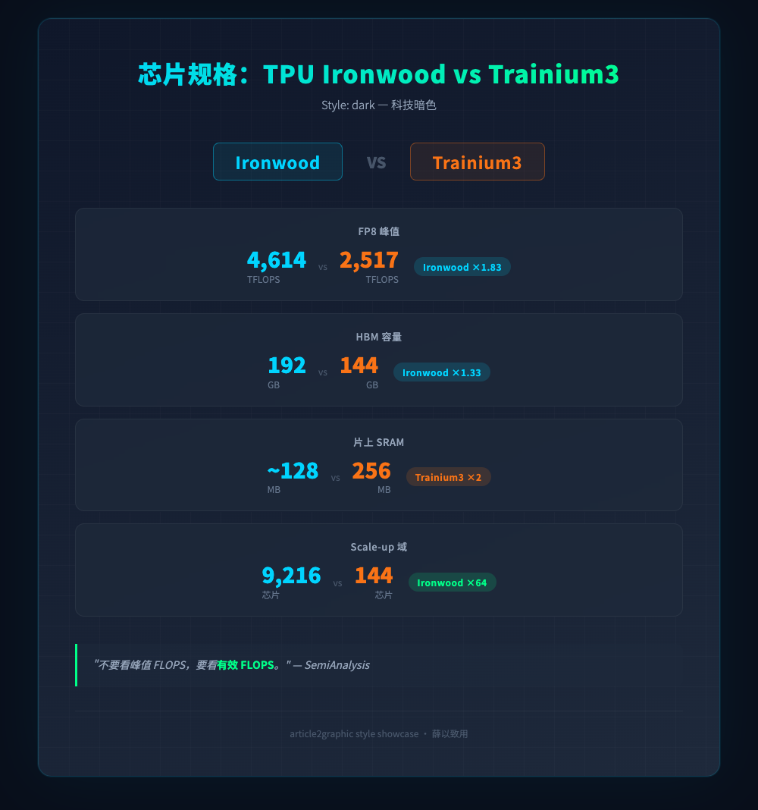
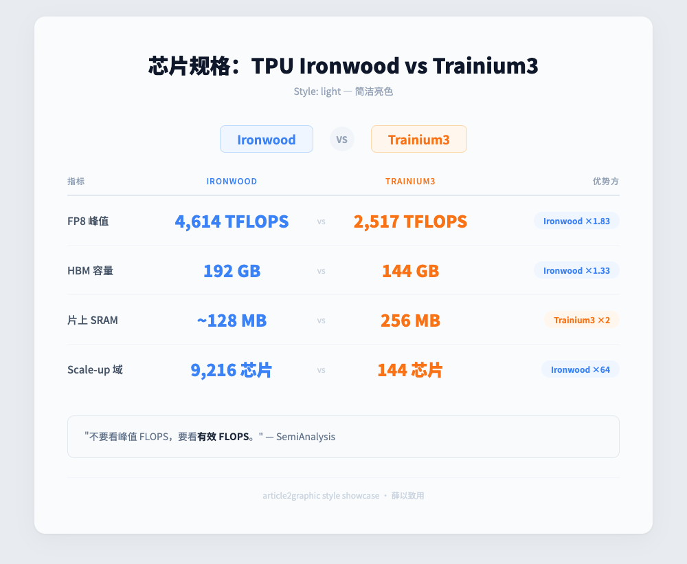
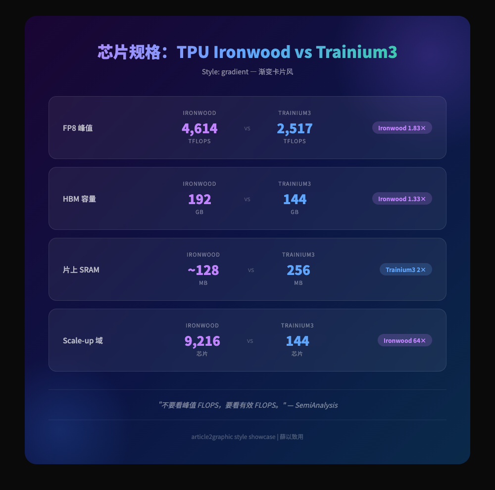
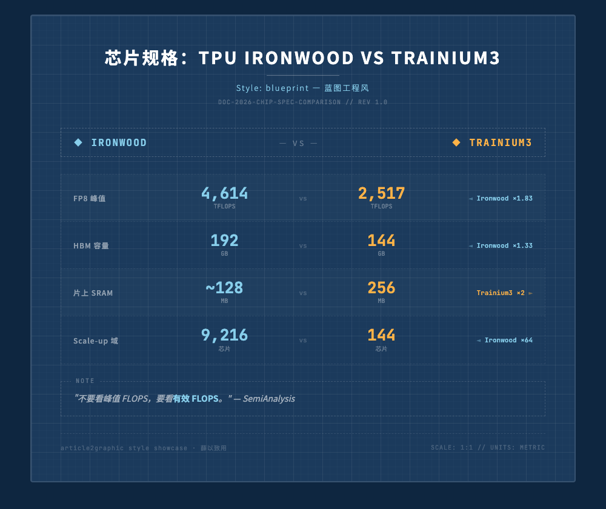
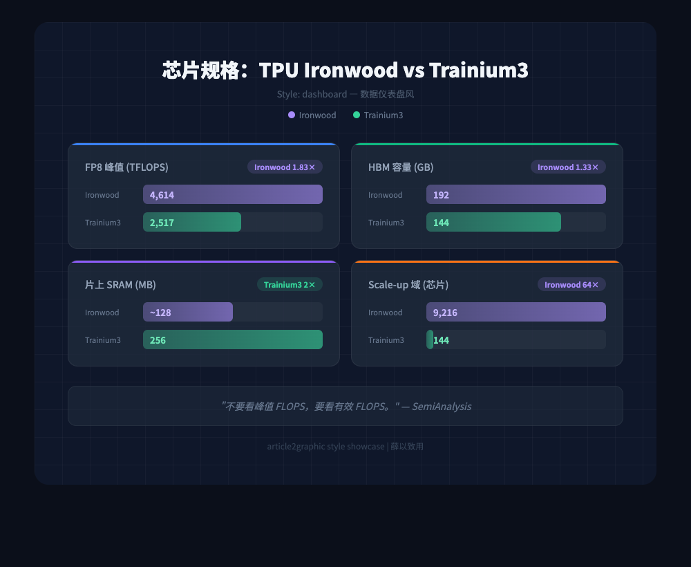
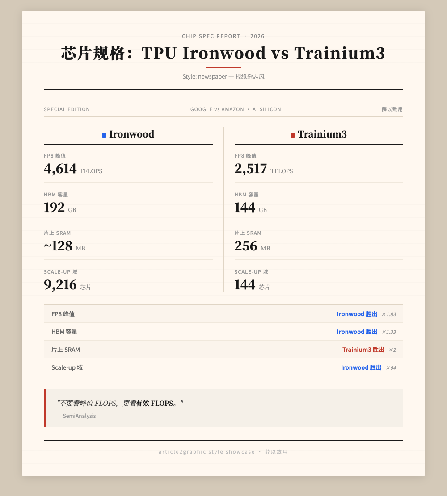
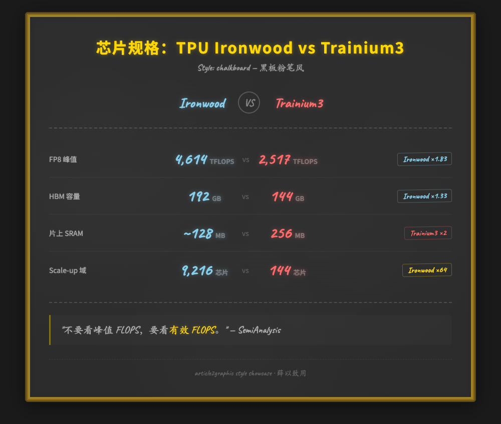
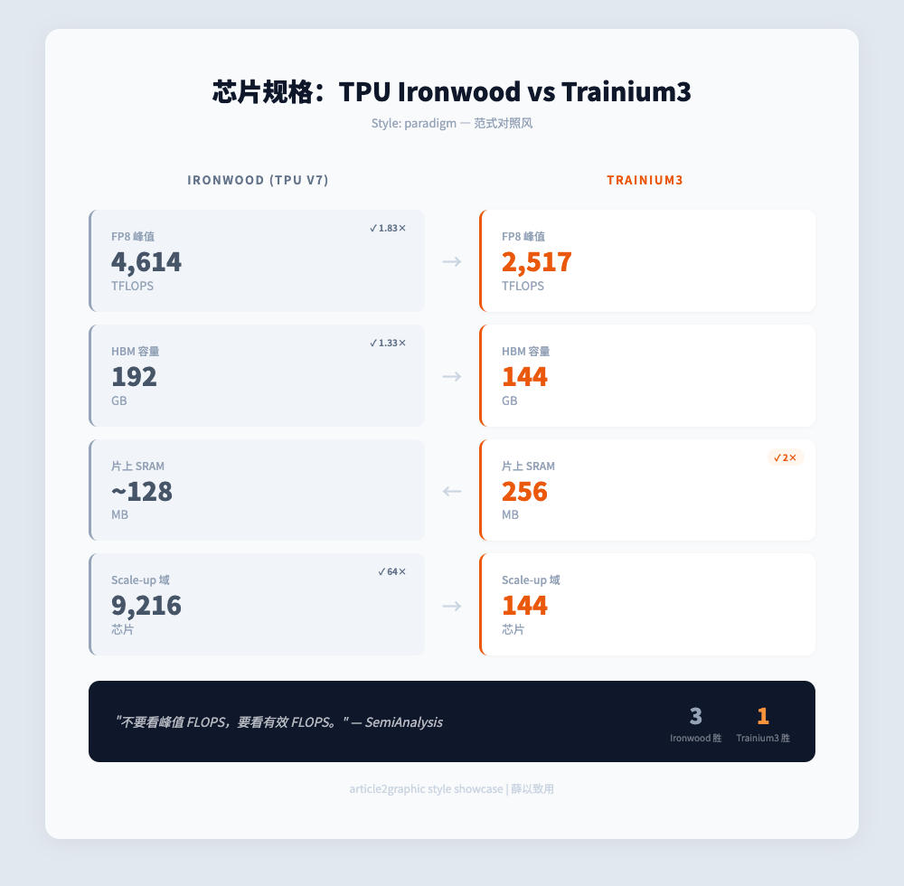
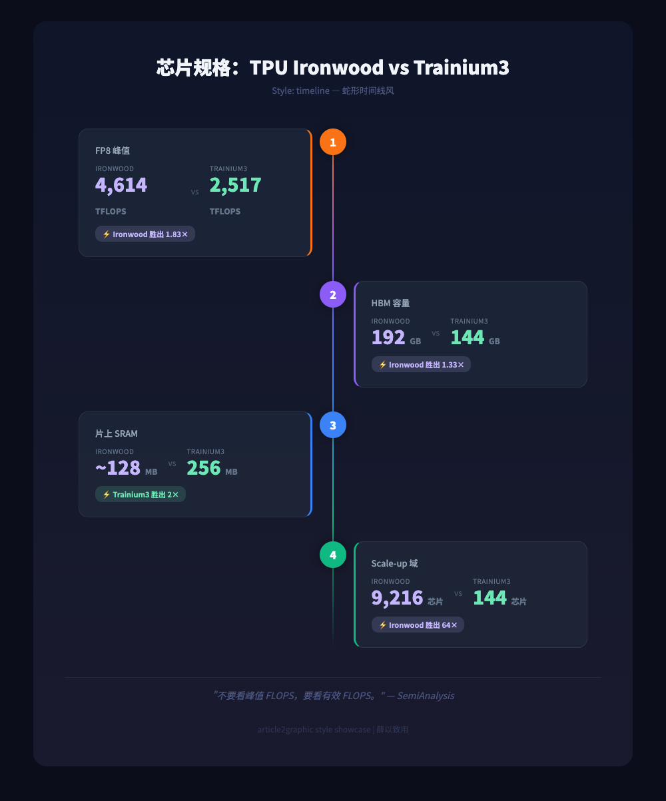
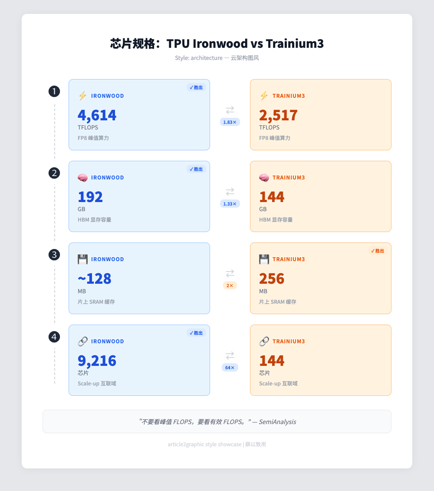

# article2graphic — Article-to-Infographic Skill

[中文](README.md)

Automatically convert Markdown articles into a series of high-quality infographics (PNG/SVG).

Powered by AI agents — no LLM configuration or API keys required. Supports Kiro, OpenClaw, and Claude Code.

## ✨ Features

- 🤖 Agent-driven: zero LLM config — your existing agent IS the generation engine
- 🎨 10+ visual styles: dark, gradient, chalkboard, blueprint, newspaper, dashboard, timeline, paradigm, architecture, and more
- 📄 7 chart types: data comparison, flow chain, CSS bar chart, card grid, quote card, timeline, concept analogy
- 📱 Multi-page storyboard: one page per chapter, unified style, visual rhythm through chart type variation
- 🖼️ Dual output: HTML+Playwright screenshot (default) or SVG vector
- 🔖 Auto watermark: QR code injection in top-right corner (optional)

## 📦 Installation

### As a Kiro Global Skill

```bash
git clone https://github.com/soldierxue/skill-article2graphic.git ~/.kiro/skills/article2graphic
```

Auto-activates when you mention "infographic", "generate illustration", etc. in Kiro chat.

### As a Claude Code Skill

```bash
git clone https://github.com/soldierxue/skill-article2graphic.git ~/.claude/skills/article2graphic
```

After installation, use in Claude Code by:
- Saying "generate infographic", "article illustration", etc. in chat to auto-trigger
- Or explicitly invoke `/article2graphic`

### As an OpenClaw Skill

```bash
# Clone into workspace directory
git clone https://github.com/soldierxue/skill-article2graphic.git article2graphic
```

In OpenClaw chat, reference:
> Follow article2graphic/SKILL.md to generate infographics for this article

### As a Standalone Project (CLI Mode)

```bash
git clone https://github.com/soldierxue/skill-article2graphic.git
cd skill-article2graphic
pip install playwright
playwright install chromium
./scripts/run.sh gen --story path/to/article.md
```

## 🔧 Dependencies

```bash
pip install playwright
playwright install chromium
```

No boto3, no AWS credentials, no model configuration needed.

## 🚀 Three Ways to Use

### Mode A: Kiro / OpenClaw IDE (Recommended)

After installing as a Kiro global skill, just say in chat:

> Generate infographics for this article

The agent auto-activates SKILL.md and follows the workflow:
1. Scan article chapters, plan storyboard spec
2. Generate HTML page by page (using design specs from `prompts/`)
3. Run `screenshot.py` for batch screenshots + QR code injection
4. Generate WeChat Moments + Xiaohongshu promo copy (`{slug}-promo.md`)

OpenClaw works the same way — reference SKILL.md in your prompt.

### Mode B: CLI Mode (kiro-cli / Claude Code)

```bash
# Auto-detect available agent (kiro-cli preferred)
./scripts/run.sh gen --story article.md

# Use Claude Code explicitly
./scripts/run.sh gen --story article.md --agent claude

# Generate from JSON spec via stdin
cat spec.json | ./scripts/run.sh gen --from-spec --slug my-article

# Dry run — generate prompts without calling agent
./scripts/run.sh gen --story article.md --dry-run

# Batch screenshot existing HTML files
./scripts/run.sh screenshot output/ --inject-qrcode
```

### Mode C: Manual Mode

1. Extract spec: `python3 scripts/extract_spec.py article.md > spec.json`
2. Write storyboard spec JSON manually (see format below)
3. Paste the prompt to any AI agent to generate HTML
4. Screenshot: `python3 scripts/screenshot.py --html-dir output/ --inject-qrcode`

## 📝 Input Format

### Option 1: Embed infographic_spec in Article

```markdown
### INFOGRAPHIC

```json
[
  {
    "page": 1,
    "type": "data comparison",
    "title": "Key Metrics",
    "color_scheme": "dark",
    "focal_point": "Key difference",
    "memory_hook": "Memorable takeaway",
    "data": { ... }
  }
]
```　
```

### Option 2: Standalone spec JSON File

See `T12-MStories/ironwood-vs-trainium3-spec.json` for reference.

### Option 3: No spec (Agent Auto-Plans)

If the article has no `infographic_spec`, the agent auto-plans per SKILL.md rules:
- Page count = article chapter count
- Unified primary style, rhythm through chart type variation

## 🎨 Visual Styles

Same content, 10 styles. All examples below use TPU Ironwood vs Trainium3 chip spec data:

| | |
|:---:|:---:|
|  |  |
| `dark` — Tech Dark | `light` — Clean Light |
|  |  |
| `gradient` — Gradient Cards | `blueprint` — Engineering Blueprint |
|  |  |
| `dashboard` — Data Dashboard | `newspaper` — Magazine Layout |
|  |  |
| `chalkboard` — Chalk on Blackboard | `paradigm` — Paradigm Shift |
|  |  |
| `timeline` — Snake Timeline | `architecture` — Cloud Architecture |

## 📁 Directory Structure

```
article2graphic/
├── SKILL.md                          ← Agent instructions (Kiro/OpenClaw entry point)
├── CLAUDE.md                         ← Claude Code entry point (references SKILL.md)
├── prompts/
│   ├── design-system-html.md         ← HTML design specification
│   ├── design-system-svg.md          ← SVG design specification
│   └── promo-writer.md               ← Social media promo writing spec
├── scripts/
│   ├── run.sh                        ← CLI entry point (calls agent)
│   ├── extract_spec.py               ← Markdown → JSON spec (pure parser)
│   └── screenshot.py                 ← HTML → PNG screenshot (pure tool)
├── assets/
│   └── qrcode_weixin_*.jpg           ← QR code watermark (replaceable)
└── output/                           ← Default output directory
```

## 🏗️ Architecture

```
Markdown Article
    ↓
extract_spec.py extracts spec (or agent auto-plans)
    ↓
run.sh builds prompt (design spec + spec data)
    ↓
Agent (Kiro / OpenClaw / kiro-cli / claude) generates HTML/SVG
    ↓
screenshot.py captures → PNG + QR watermark
    ↓
Agent generates promo copy → {slug}-promo.md (WeChat Moments + Xiaohongshu)
```

## 🔄 Customization

- Replace QR code image in `assets/` with your own
- Modify design specs in `prompts/` to adjust visual styles
- Edit `Activate when` keywords in `SKILL.md` to change trigger conditions

## License

MIT
